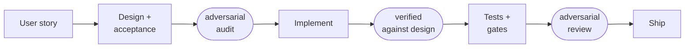
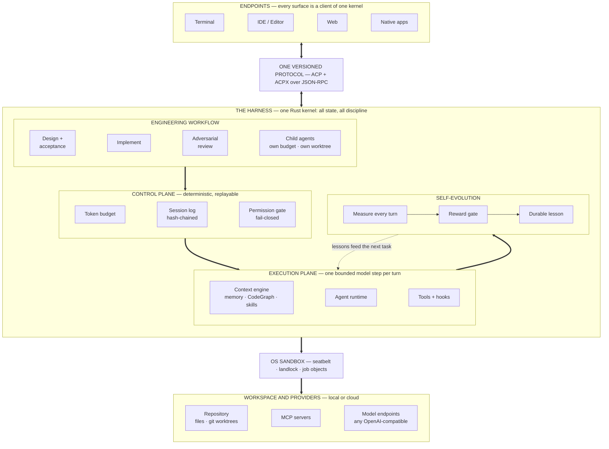

<div align="center">

# houyicoder

### Models converge. Engineering compounds.

An enterprise-grade AI software engineering system — the workflow,
knowledge, and evidence of real engineering, built as a system around
any model.

[](https://github.com/YiLabsAI/HouYiCoder/actions/workflows/ci.yml)
[](https://codecov.io/gh/YiLabsAI/HouYiCoder)
[](LICENSE)
[](rust-toolchain.toml)
[](https://modelcontextprotocol.io)
[](https://agentclientprotocol.com)

</div>

The first generation of coding agents traded away fifty years of
engineering infrastructure for a chat loop. Symbol graphs, refactoring
safety, review surfaces, project knowledge — abandoned, because text in
and diffs out was enough to demo, and the model's raw capability covered
the difference.

That trade stops paying. Models are converging: whichever one you rent
this quarter, everyone rents next quarter. The model is not where an
agent can win — and a prompt can *request* discipline, but it cannot
enforce it, and it accumulates nothing.

houyicoder is built on the other side of that argument. The engineering
lives in the system, not the prompt: a design and its acceptance criteria
before code, adversarial review between every stage, evidence behind
every claim, and knowledge that accrues to your repository instead of
evaporating with the session. Swap the model and it gets faster. Keep
using it and it gets better — and that part is yours.

## The workflow it runs



Every stage produces an artifact; every transition passes a gate; the
audits are adversarial — independent agent reviewers whose job is to
break the design before code exists and to break the claim before it
ships. The agent cannot jump from a one-line request to a pile of diffs,
because the system offers no such path. Your own gates — lint, tests,
policy — plug into the same mechanism as hooks and run inside the loop.

## Quick start

Built from source today; signed binaries and package-manager installs
are coming.

```bash
# 1. build (Rust stable, pinned in rust-toolchain.toml)
git clone https://github.com/YiLabsAI/HouYiCoder.git
cd HouYiCoder && cargo build --release

# 2. point it at any OpenAI-compatible endpoint
export OPENAI_API_KEY=sk-...
export OPENAI_BASE_URL=https://...

# 3. run
./target/release/houyi
```

Inside the app, `/help` lists every command: `/context` shows exactly
where your tokens went, `/trajectory` replays the session, `/status`
reports model, sandbox, and connectivity. Preferences persist in
`~/.houyicoder/settings.json` — including an `apiKeyHelper` hook that
fetches the key from your secret manager at startup, so it never has to
live in a file or an exported variable.

## Capabilities

| | Capability | What it means |
|---|---|---|
| **Engineering Workflow** | Spec-driven development | Design → implement → verify as enforced stages, each with an artifact and an approval — structure, not a system-prompt suggestion |
| | Design first | Module boundaries, interface contracts, core types and algorithms are decided and reviewed as artifacts — the decisions that determine whether code survives its second year |
| | Adversarial review | Independent reviewer agents audit the design before code and the implementation before merge — review is a stage, not a favor you remember to ask |
| | Multi-agent delegation | A subtask runs as its own session: own token budget, own git worktree, same fail-closed gates |
| | Workflow hooks | Pre-use, post-use, and post-failure hooks let your own gates allow, deny, or amend real tool calls |
| **Context Engineering** | Measured context | `/context` decomposes the served view — system, tools, memory, skills, messages — with real token counts; nothing is a guess |
| | CodeGraph | LSP-fed, repository-scale symbol and impact queries, so a change is planned against what it actually touches |
| | Structured memory | Typed, versioned entries with origin tracking and a promote/demote lifecycle — project knowledge, not a flat text file |
| | Team knowledge | Conventions and lessons that outlive the session and travel across a team |
| **Governed Autonomy** | Human-in-the-loop | Per-change diff approval, permission prompts, mid-run steering — redirect the agent without killing the run |
| | Human-on-the-loop | Watch without interrupting: live trajectory, token budget, per-tool cost and failure rates |
| | Reviewable artifacts | The spec, the design, and every diff are inspectable records — anyone who asks "what did the AI actually do" can see, trace, and verify |
| **Observability & Audit** | Hash-chained session log | Every event appends to a self-verifying chain; tampered or corrupted history is detected, never silently trusted |
| | Replay & export | Drill turn → event → payload with token counts and cost; export the full record — with secrets redacted by default |
| **Self-Evolution** | Closed evidence loop | Wasted work is detected, distilled into a durable lesson, and recalled on the next matching task — measurable improvement on *your* codebase, not fine-tuning folklore |
| **Token Economy** | Budget as an input | Cache-aware prefix ordering and multi-layer compaction with originals preserved; spending is planned and measured, not hoped |
| **Security & Isolation** | Fail-closed permissions | Destructive tools default to deny; the pipeline judges the *resolved* path, so symlink bypasses are caught |
| | OS-level sandbox | Shell runs behind macOS seatbelt, Linux landlock, or Windows job objects |
| **Harness Architecture** | One kernel, every endpoint | Terminal, IDE, web, and native apps are clients of one protocol — the same agent, the same session, everywhere |
| | Single binary, any platform | No runtime dependencies; macOS, Linux, Windows; local or cloud |

## Architecture



- **A surface is a client, not a fork.** The kernel holds all state, so
  the agent you drive from the terminal is the same agent, in the same
  session, your editor drives.
- **Determinism is separated from the model.** The control plane decides
  what is allowed and records what happened; the execution plane runs
  exactly one bounded step. Non-deterministic results are snapshot-
  persisted, so any run replays without re-running.
- **Many agents are the default, not a feature.** An agent is a session
  in the harness — a child inherits the budget, the isolation, and the
  gates rather than opting into them.

## Open by design

Every boundary is a published wire format or an open standard — which is
what makes houyicoder embeddable, auditable, and extendable rather than
merely usable.

| Standard | Role | What it gives you |
|---|---|---|
| **[ACP](https://agentclientprotocol.com)** | Drive the agent | Any ACP client — your editor, your pipeline — runs houyicoder as its backend |
| **ACPX** | Extend the protocol | Our open extension namespace over ACP for what the base standard lacks, such as token-level streaming; standard clients ignore it and keep working |
| **[MCP](https://modelcontextprotocol.io)** | Add tools | External MCP servers register like native tools, behind the same permission gate |
| **[LSP](https://microsoft.github.io/language-server-protocol/)** | Understand code | Language servers feed symbol-precise, compiler-grade code intelligence |
| **CodeGraph** | Query the repository | An open graph of symbols and impact over the whole repo — your tooling queries what the agent queries |
| **OpenTrajectory** | Audit the run | Our open execution-record format, built on the hash-chained session log: turns, tool calls, tokens, cost. Diff it, replay it, feed it to your own analytics |
| **OpenEvolution** | Audit the learning | Our open standard for observable self-evolution: every reward signal, lesson, and recall is an inspectable event — "the agent improved" becomes a claim you can verify |
| **Skills** | Package procedures | Reusable procedures loaded on demand, budgeted and measured like all context |

## Engineering

houyicoder is built by houyicoder — every commit goes through the agent
and the same discipline it enforces for you.

- **Design as an artifact, per feature.** Each feature carries a design
  document — architecture and sequence diagrams, core types, algorithms
  with performance constraints — plus an acceptance document that fixes
  what "done" means before implementation begins.
- **A twelve-step delivery pipeline** from user story to shipped change,
  with adversarial multi-agent audits between stages: the design is
  attacked before code exists, the implementation is verified against
  its design, and review runs as a two-agent opposed gate.
- **Structure is enforced, not documented.** The crate dependency graph,
  naming, file size, dead modules, and comment style are machine-checked;
  a dependency edge outside the allowed layering fails the build.
- **Tests assert what users see.** Unit, integration, and UI layers; the
  terminal is tested by rendering to a real backend and by driving the
  actual binary through a PTY, keystroke by keystroke. Cross-path
  invariant tests are mutation-verified before they are allowed to count.
- **Coverage is a gate, twice** — a floor across the workspace and a
  floor on every line a change adds or modifies.
- **Three platforms on every push** — Linux, macOS, and Windows in CI,
  with dependency license and security-advisory audits.
- **The loop itself is budgeted.** Incremental check under thirty
  seconds, the full pre-commit gate under a minute — discipline only
  holds if it is fast enough to run every time.

```bash
make check   # the full gate: fmt, clippy, typecheck, tests, structure
```

## Status

**Active development, in the open.** The architecture above is the
terminal state houyicoder is built to, and the system builds itself
toward it daily — every commit in this repository went through the agent
and its gates. Wire and config formats are still moving; expect breaking
changes until 1.0.

## Terminal notes

**iTerm2 (macOS)**: for mouse-wheel transcript scrolling, open
Preferences → Profiles → [profile] → Terminal, then **uncheck** "Save
lines to scrollback in alternate screen mode" and **check** "Mouse
Reporting". Ghostty and other terminals work without configuration.
Keyboard fallback: `PageUp`/`PageDown` to scroll, `End` to return to tail.

## Contributing

houyicoder is built in the open, and contributions of every kind are
welcome — code, tests, docs, bug reports, and hard questions about the
design.

- Start with [CONTRIBUTING.md](CONTRIBUTING.md); the engineering rules
  the gates enforce live in [AGENTS.md](AGENTS.md)
- `make check` runs the full local gate — if it is green, CI will be too
- Open an [issue](https://github.com/YiLabsAI/HouYiCoder/issues) for
  bugs, or a [discussion](https://github.com/YiLabsAI/HouYiCoder/discussions)
  for design and direction — we read both

## License

[MIT](LICENSE)
