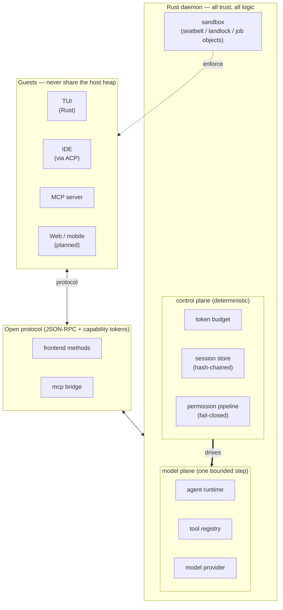

<div align="center">

```
    ..::..
  .::::::::::.
  ::::::::::::::
->|*:::::::::::
  ::::::::::::::
  '::::::::::'
    '..::..'
```

# houyicoder

### One harness. Every surface. Evidence for everything.

An enterprise-grade coding agent, built as a harness rather than an app.

[](https://github.com/YiLabsAI/HouYiCoder/actions/workflows/ci.yml)
[](https://codecov.io/gh/YiLabsAI/HouYiCoder)
[](LICENSE)
[](rust-toolchain.toml)
[](https://modelcontextprotocol.io)
[](https://agentclientprotocol.com)

</div>

Most coding agents are an application with a UI bolted on. houyicoder is
a Rust core behind one versioned protocol — every surface is a client, so
the agent you drive from your terminal is byte-for-byte the agent your
IDE drives, and the one a web or mobile client will drive.

That architecture buys the thing single-surface agents cannot offer:
**you can work either way.** Stay in the terminal for the AI-native
loop — describe the outcome, let the agent drive. Or connect from your
editor over ACP and keep the IDE workflow you already have. Same core,
same session, same audit trail.

And because the core owns everything, it can prove what it did. Every
turn lands in a hash-chained, replayable event log. Every token is
accounted against an explicit budget. Every wasted action feeds a reward
loop that distills the failure into a durable lesson the next session
recalls — so the agent measurably improves on *your* codebase the longer
you use it.

> **houyicoder doesn't ask you to trust the output. It shows you the evidence.**

**Five things it does that others don't:**

1. **One harness, every surface** — one Rust core, one protocol; frontends
   are untrusted clients, never forks
2. **Two ways to work** — AI-native terminal loop, or IDE-driven over ACP,
   against the same session
3. **Evidence by construction** — hash-chained event log, replay, per-tool
   cost accounting, secret redaction
4. **Gets better with use** — a closed reward loop turns the agent's own
   mistakes into recalled lessons
5. **Enterprise-grade defaults** — fail-closed permissions, real OS
   sandboxes, cross-platform single binary

## Key Features

| Category | Feature | What it means |
|----------|---------|---------------|
| **Trust & Reproducibility** | Hash-chained session log | Every event is appended to a hash-chained log; the chain verifies itself on load, so a tampered or corrupted history is detected, not silently trusted |
| | Replay & audit | `/trajectory` drills turn → event → payload with byte positions, token counts, and cost; `/export` writes the full record to JSON |
| | Immutable state | Checkpoints and session versions are append-only; undo never rewrites history |
| **Observability** | Context as a budget | `/context` shows exactly where your tokens went; `/tools` shows per-tool call counts, failure rates, and cost |
| | Redundancy nudge | The agent detects when it is repeating a wasteful call and nudges itself to stop — waste is visible, not absorbed |
| | Secret redaction | Secrets in trajectories and exports are redacted by default |
| **Self-Improvement** | Closed reward loop | Blind-retry detection → consolidated reflection → a distilled lesson written to structured memory → recalled on the next matching query. The loop is end-to-end observable |
| | Structured memory | Typed, versioned entries with origin tracking (user vs agent) and promote/demote lifecycle — not a flat text file |
| **Token Economy** | Explicit budget planner | Cache-aware prefix ordering and multi-layer compaction with originals preserved; spending is planned, not hoped |
| **Safety** | Fail-closed permissions | Destructive tools default to deny; the permission pipeline judges the *resolved* file path, so symlink bypasses are caught |
| | OS-level sandbox | Shell runs in a real OS sandbox: macOS seatbelt, Linux landlock, Windows Job Objects |
| | Capability-scoped guests | Every frontend and plugin is an untrusted guest over the wire; nothing shares the host heap |
| **Harness** | One protocol, every surface | Frontends are untrusted clients over one versioned JSON-RPC protocol with capability tokens. The TUI holds no engine state — a new frontend is a new client, not a fork (see [Protocol](#protocol)) |
| | Terminal *and* IDE | Drive the AI-native loop from the terminal, or let your editor drive the same core over ACP. Not two products — two clients |
| | Project-aware discipline | The agent reads your `AGENTS.md` and structured memory on every session, and works through explicit Design → Implement → Verify stages instead of one undifferentiated chat |
| **Platform** | Single binary | No runtime dependencies; builds for macOS, Linux, and Windows |
| | Any OpenAI-compatible API | Point it at any OpenAI-compatible endpoint; a model catalog tracks per-model context windows, priority, and cost |

## Quick Start

```bash
git clone https://github.com/YiLabsAI/HouYiCoder.git
cd HouYiCoder
cargo build --release
```

Configure any OpenAI-compatible provider and launch:

```bash
export OPENAI_API_KEY=sk-...        # or DASHSCOPE_API_KEY / HOUYICODER_API_KEY
export OPENAI_BASE_URL=https://...  # any OpenAI-compatible endpoint
./target/release/houyi              # launch the TUI
```

Type `/help` inside the TUI for the command palette. `/context` shows the
token budget, `/trajectory` replays the session event log, and `/status`
reports model, sandbox, and connectivity.

## Architecture



One Rust daemon holds all trust. Everything else — TUI, IDE, plugins,
sidecars — is a guest that speaks the open protocol; guests never share
the host heap. The control plane (budget, session, permissions) is
deterministic; the model plane executes one bounded step. Untrusted
leaves (model responses, memory recall) are snapshot-persisted, so a run
can be replayed.

## Protocol

The boundary between the host and every guest is a versioned JSON-RPC
protocol with typed capability tokens — the seam that makes the TUI a
pure client and any third-party frontend possible.

Externally, houyicoder speaks the two open standards of the agent
ecosystem:

- **[MCP](https://modelcontextprotocol.io)** — external tool servers are
  consumed through the standard Model Context Protocol
- **[ACP](https://agentclientprotocol.com)** — an Agent Client Protocol
  adapter lets an IDE drive houyicoder as its agent backend

## Engineering

The repo enforces its standards as gates, not aspirations:

- **~90% line coverage** across the workspace, gated two ways: a workspace
  unit-coverage floor and an 85% floor on every line a change adds or modifies
- **2,770 tests** — unit, integration, and PTY-driven UI tests that render
  the real app to a test backend and assert on the buffer
- **Zero clippy warnings** (`-D warnings`), no `unsafe`, rustfmt clean
- Custom gates for comment style, naming, file size, and the crate
  dependency graph — all wired into `make check`

## Status & Roadmap

**Active development.** houyicoder builds itself daily — every commit in
this repo went through the agent and its gates. The wire protocol and
config formats are still moving, so expect breaking changes between
releases until 1.0.

| Area | State |
|------|-------|
| TUI, protocol wire, session store + replay | shipped |
| Permission pipeline, OS sandboxes, redaction | shipped |
| Structured memory + reward loop | shipped |
| MCP tool servers, ACP adapter | shipped |
| Code graph (LSP-backed symbol + impact queries) | in design |
| Multi-agent orchestration and workflow replay | in design |
| Web and mobile frontends | in design |
| OpenTelemetry export for operations pipelines | in design |

## Terminal Notes

**iTerm2 (macOS)**: for mouse-wheel transcript scrolling, open
Preferences → Profiles → [profile] → Terminal, then **uncheck** "Save
lines to scrollback in alternate screen mode" and **check** "Mouse
Reporting". Ghostty and other terminals work without configuration.
Keyboard fallback: `PageUp`/`PageDown` to scroll, `End` to return to tail.

## Contributing

See [CONTRIBUTING.md](CONTRIBUTING.md). Engineering rules live in
[AGENTS.md](AGENTS.md).

## Community

- [GitHub Issues](https://github.com/YiLabsAI/HouYiCoder/issues)
- [GitHub Discussions](https://github.com/YiLabsAI/HouYiCoder/discussions)

## License

[MIT](LICENSE) · Copyright © 2026 The houyicoder authors

<div align="center">

houyicoder · hi = HouYi (后羿), the archer who shot down nine suns

</div>
